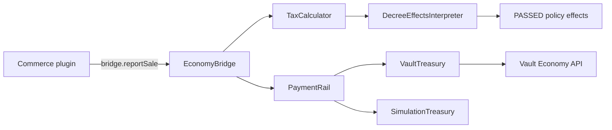

# Economy Hooks — Design

**Date:** 2026-08-05
**Status:** Approved for implementation (brainstorming complete)
**Scope:** New World-style settlement economy for Guilds Territory: a public transaction API other plugins report sales into, tax on those sales sourced from PASSED policy decree effects, and a settlement treasury (Vault-backed or simulated).

## 1. Goal

Give Guilds Territory an economy layer that:
1. Exposes a **public transaction API** (`EconomyBridge`) that other plugins call to report a sale; Guilds applies the owning settlement's tax and credits the treasury. This directly answers the user's "develop an API first please."
2. Sources tax rates from **PASSED policies** carrying structured `DecreeEffects` — completing the existing `// Future:` stub in `DecreeEffectsInterpreter.taxRatesFromPolicies(...)` and wiring `DecreeEffects` onto `Policy`.
3. Backs the **settlement treasury** with Vault's `Economy` API (soft-depend), with an opt-in non-monetary simulation mode for dev/test.

Out of scope (explicitly): crafting tax, shop-plugin integration, upkeep/fortification cost schedules, trading-post storage. The API is designed so a crafting reporter can be added later as one more transaction source, but it is NOT built now.

## 2. Architecture

New pure-domain package `com.guilds.territory.economy` (Bukkit-free, matching `model`/`decree`/`registry` conventions). Vault/Bukkit wiring lives in `GuildsTerritoryPlugin`, `listener`, and the Vault facade.



### Layering

- **`economy` package (pure domain, no Bukkit/Vault):**
  - `EconomyBridge` — the public API. Owns no Vault dependency; depends on a `PaymentRail` interface and `GovernanceRegistry`.
  - `TaxCalculator` — pure tax math: `tax = gross * ratePercent / 100`.
  - `TaxReport` — immutable outcome record (see §4).
  - `PaymentRail` — the money-movement seam: withdraw from payer, deposit to territory treasury, refund to payer, with compensation outcomes (see §3). This is the interface through which the pure domain realizes §5.
  - `SimulationTreasury` — implements `PaymentRail` as an in-memory, non-monetary ledger.
- **`GuildsTerritoryPlugin` scope (Bukkit/Vault wiring):**
  - `VaultTreasury` — implements `PaymentRail` over Vault's `Economy` bank + player APIs.
  - `EconomyConfig` — loads `economy.mode` from `config.yml`.
  - `GuildsTerritoryPlugin.getEconomyBridge()` — public getter for other plugins.

**Isolation rule:** `economy` package never references Bukkit or Vault. `TaxCalculator`, `SimulationTreasury`, and `EconomyBridge` are unit-tested with no Paper/Vault present. `VaultTreasury` is thin and only tested via the wiring test with a mocked Vault `Economy`.

## 3. Money movement — `PaymentRail` seam, single source of truth

Exactly **one** `PaymentRail` implementation is active at a time, selected by `economy.mode` (`VAULT` default | `SIMULATION`). Guilds never keeps a ledger *and* a Vault bank both authoritative.

### `PaymentRail` — the money-movement seam (pure domain)

```java
public interface PaymentRail {
    /** Atomically settle: withdraw from payer, deposit to territory treasury, compensating refund on failure. */
    SettlementResult settle(UUID payerId, String territoryId, double amount);

    /** True if this rail can move money at all (Vault present + bank support). */
    boolean available();
}
```

`PaymentRail` exposes **one** method, `settle(...)`, which encapsulates the entire withdraw → deposit → refund compensation sequence and reconciliation internally. The caller cannot observe or interfere with the intermediate staged state — there are no public primitives to misorder. The low-level Vault calls (`withdrawPlayer`, `bankDeposit`, `depositPlayer`) are **private to `VaultTreasury`** and never exposed through the interface.

This is the seam through which the pure-domain `EconomyBridge` realizes §5: it calls `rail.settle(payerId, territoryId, taxAmount)` and maps the returned `SettlementStatus` to a `TaxOutcome`. `SimulationTreasury` implements `settle` as an in-memory, non-monetary ledger. `VaultTreasury` implements it over Vault's player + bank APIs.

### `SettlementResult` — atomic outcome (pure domain)

```java
enum SettlementStatus {
    INSUFFICIENT_FUNDS,   // payer can't cover the amount; nothing moved
    PAYER_UNAVAILABLE,    // payer has no account; nothing moved
    SETTLED,              // payer charged AND treasury credited
    COMPENSATED_FAILURE,  // payer charged, treasury deposit failed, payer refunded (net-zero)
    RECONCILIATION_REQUIRED  // payer charged, deposit failed, refund failed (stranded)
}

record SettlementResult(SettlementStatus status) {}
```

The `SettlementStatus` enum has exactly five mutually-exclusive states — no impossible or ambiguous combinations. The bridge maps directly:

| `SettlementStatus` | `TaxOutcome` |
|---|---|
| `INSUFFICIENT_FUNDS` | `INSUFFICIENT_FUNDS` |
| `PAYER_UNAVAILABLE` | `PAYER_UNAVAILABLE` |
| `SETTLED` | `TAXED` |
| `COMPENSATED_FAILURE` | `SETTLEMENT_FAILED` |
| `RECONCILIATION_REQUIRED` | `SETTLEMENT_RECONCILIATION_REQUIRED` |

The rail never returns `SETTLED` unless both legs completed; the bridge never invents an outcome.

### VAULT mode (default)

- `VaultTreasury` implements `PaymentRail` over Vault's `Economy`. Territory balances live in Vault **bank accounts** (bank id = territory id). Vault is the **sole source of truth**; balances persist via Vault's own storage, so no Guilds disk persistence is needed.
- `reportSale` succeeds only if **both** the payer withdrawal **and** the treasury bank deposit complete. Never returns success on a partial transfer.
- **Persistence:** on `onEnable`, bank balances are authoritative; balances survive restart through Vault's storage. Guilds writes no economy state to disk.

### SIMULATION mode (dev/test, opt-in)

- `SimulationTreasury` implements `PaymentRail` as an explicitly **non-monetary** in-memory ledger. No real money moves. It is opt-in via `economy.mode: SIMULATION` and logged clearly at startup.
- No Guilds disk persistence: balances reset on restart (it is virtual money by design). This is a feature, not a gap.

## 4. Public API

### Pure-domain `EconomyBridge` (Bukkit-free)

```java
public final class EconomyBridge {
    public TaxReport reportSale(
        UUID payerId,                 // who pays the tax (the seller)
        String worldId, int blockX, int blockZ,  // where the sale happened
        String goodId,                // normalized good id
        double grossAmount            // pre-tax transaction value
    );
}
```

The domain API takes a `UUID` payer id (no Bukkit types). The **payer** (`UUID`) is the party taxed. The **payee** is the territory's treasury bank account, derived from `(worldId, blockX, blockZ)` via `TerritoryRegistry.resolve(...)` + `GovernanceRegistry.resolveForTerritory(...)` (see §7). No stateless credit — every successful report has an explicit payer and payee.

### Bukkit adapter

A thin `BukkitEconomyBridge` (in plugin scope) adds a convenience overload that takes `OfflinePlayer` and delegates to the domain `EconomyBridge.reportSale(player.getUniqueId(), ...)`. This keeps the domain free of Bukkit while giving commerce plugins a Bukkit-friendly entry point. The Vault payer lookup (`economy.getBalance(payerId)`) is done by the Vault facade keyed on the `UUID`, not on the `OfflinePlayer` object.

### `TaxReport` — immutable outcome

```java
record TaxReport(
    TaxOutcome outcome,
    @Nullable String territoryId,
    @Nullable String goodId,
    double ratePercent,   // aggregated PASSED-policy rate, or 0
    double taxAmount      // gross * ratePercent / 100, or 0
) {}
```

### `TaxOutcome` enum

| Outcome | Meaning |
|---|---|
| `TAXED` | Tax computed, payer charged, treasury credited (both succeeded). |
| `NO_TERRITORY` | Location not inside any territory. Nothing mutated. |
| `NO_GOVERNMENT` | Territory has no governing body / is anarchy. Nothing mutated. |
| `NO_TAX` | No PASSED policy sets a tax rate for this good. Nothing mutated. |
| `UNKNOWN_GOOD` | `goodId` not in the catalog. Nothing mutated. |
| `INVALID_AMOUNT` | `grossAmount` non-positive or non-finite. Nothing mutated. |
| `PAYER_UNAVAILABLE` | Payer id has no Vault account. Nothing mutated. |
| `VAULT_UNAVAILABLE` | Vault absent, or its economy lacks bank support. Nothing mutated. |
| `SIMULATED_TAXED` | SIMULATION mode: tax computed and credited to the simulation ledger; no real money moved. See §3. |
| `INSUFFICIENT_FUNDS` | Payer cannot cover the tax. Nothing net mutated (refunded). |
| `SETTLEMENT_FAILED` | Payer was charged but treasury deposit failed; the payer was refunded (net-zero). No money lost. |
| `SETTLEMENT_RECONCILIATION_REQUIRED` | Payer was charged, treasury deposit failed, AND the refund failed. Durable recovery required. See §5. |

**Invariants (VAULT mode):** `TAXED` is returned iff the payer was charged **and** the treasury was credited, with no net money lost. A transient partial state (payer charged, treasury not credited) is only ever resolved by a successful refund (net-zero, `SETTLEMENT_FAILED`) or surfaced as `SETTLEMENT_RECONCILIATION_REQUIRED` for durable recovery — never reported as success. A treasury balance only ever reflects a completed, real transfer.

## 5. Atomic settlement (VAULT mode)

Vault's `Economy` API provides no atomic two-account transaction, so the sequence below is **encapsulated inside `VaultTreasury.settle(...)`** — the bridge never stages it. The rail runs **withdraw payer first, then deposit the bank**, so a failure can always be unwound back to the payer:

1. **Precheck (bridge):** resolve territory + rate. If not taxable, return the corresponding outcome. Nothing mutated.
2. **Balance check (rail):** confirm the payer can cover `amount`; else return `SettlementStatus.INSUFFICIENT_FUNDS`. Nothing mutated.
3. **Withdraw payer (rail):** `economy.withdrawPlayer(payerId, amount)`.
   - On failure → `INSUFFICIENT_FUNDS` (or `PAYER_UNAVAILABLE` if no account). Nothing mutated.
4. **Deposit treasury (rail):** `economy.bankDeposit(territoryId, amount)`.
   - On success → `SETTLED`.
5. **Deposit failure → compensate (rail):** `economy.depositPlayer(payerId, amount)` to refund.
   - Refund succeeds → `COMPENSATED_FAILURE`. **No net money lost.**
   - Refund *also* fails → `RECONCILIATION_REQUIRED` + durable recovery entry (§ Reconciliation).

The low-level Vault calls in steps 2–5 are **private to `VaultTreasury`**; no other class can invoke `withdrawPlayer`/`depositPlayer`/`bankDeposit`. Strict ordering and status semantics are enforced by the rail, not by callers.

**Never claim "nothing mutated" for a partial failure.** Step 3 mutates the payer before step 4 runs; the guarantee is that a failed settlement is left **net-zero** (refunded) or flagged for durable reconciliation — never reported as success.

### Reconciliation (durable, admin-visible recovery)

If the step-5 refund fails, the payer has been charged but the treasury has nothing. Guilds records `{ territoryId, payerUuid, amount, timestamp, reason }` into a **reconciliation queue** and logs it at `SEVERE`. The queue is persisted to `<dataFolder>/reconciliation.json` (Gson, already a dependency) so it survives restart. Recovery is admin-visible via `getEconomyBridge().unresolvedTransactions()`; the admin resolves the stranded charge (refund the player) using their Vault tooling. Guilds does not auto-retry or silently swallow the inconsistency.

## 6. Decree wiring — completing the `// Future:` stub

- **`Policy`**: add `DecreeEffects effects` field (default `DecreeEffects.empty()`). Thread through the constructor, `withVote`, `withStatus`, `equals`, `hashCode`, `toString`. Add accessor `effects()`.
- **`PolicyRules.propose(...)`**: add an `effects` parameter; `Territory.proposePolicy(...)` passes it through. `Policy.propose(...)` keeps a zero-effects overload for back-compat. `castVote`/`decree`/`resolveIfPossible` preserve the existing `effects` unchanged.
- **`TerritoryJson`**: serialize `effects` in `policyToJson`/`policyFromJson` via `DecreeEffectsCodec.toJson`/`fromJson`. Absent `effects` key on read → `DecreeEffects.empty()` (back-compat with existing data).
- **`DecreeEffectsInterpreter.taxRatesFromPolicies(...)`**: complete the stub — for each PASSED policy, merge `taxRatesByGoodId(p.effects())` additively. Rejected/proposed policies contribute nothing. Empty/null collection → empty map.

## 7. Data flow (VAULT mode, `TAXED` path)

1. Commerce plugin calls `bridge.reportSale(payerId, worldId, x, z, goodId, gross)`.
2. Bridge resolves the territory via `TerritoryRegistry.resolve(worldId, x, z)` → `LookupResult`. If `!isContained()` → `NO_TERRITORY`; else extract `String territoryId = hit.territoryId().orElseThrow(...)` (a contained hit is guaranteed to carry an id). The following steps use only `territoryId`, never re-resolve.
3. Bridge resolves government via `GovernanceRegistry.resolveForTerritory(territoryId)`. No governing body / anarchy → `NO_GOVERNMENT`.
4. Bridge loads the territory's policies, calls `taxRatesFromPolicies(...)`, reads the rate for `goodId`. No rate → `NO_TAX`.
5. `TaxCalculator.tax(gross, rate)` → `taxAmount`.
6. Atomic settlement: `rail.settle(payerId, territoryId, taxAmount)` → map `SettlementStatus` to `TaxOutcome` (`SETTLED`→`TAXED`, `COMPENSATED_FAILURE`→`SETTLEMENT_FAILED`, `RECONCILIATION_REQUIRED`→`SETTLEMENT_RECONCILIATION_REQUIRED`; see §5).

## 8. Error handling summary

- Pre-transfer outcomes (`NO_TERRITORY`, `NO_GOVERNMENT`, `NO_TAX`, `UNKNOWN_GOOD`, `INVALID_AMOUNT`, `PAYER_UNAVAILABLE`, `VAULT_UNAVAILABLE`, `INSUFFICIENT_FUNDS`) mutate **nothing** (verified by tests).
- `SETTLEMENT_FAILED`: payer was charged, treasury deposit failed, payer refunded → net-zero, no money lost.
- `SETTLEMENT_RECONCILIATION_REQUIRED`: payer charged, deposit failed, refund also failed → durable recovery entry (see §5).
- `VAULT_UNAVAILABLE`: Vault absent or bank-less. `reportSale` fails cleanly; Guilds still runs (protection, web, governance unaffected).
- `SIMULATION` mode: non-monetary by configuration; returns `SIMULATED_TAXED`, never `TAXED`; logged clearly at startup.
- **No minting:** in VAULT mode a treasury balance never appears without a matched payer charge. Simulation is explicitly virtual and separately gated.
- Refund failure → `SETTLEMENT_RECONCILIATION_REQUIRED` + durable reconciliation, never a false success.

## 9. Config

Add an `economy:` block to `config.yml`, loaded by a new `EconomyConfig`:

```yaml
economy:
  mode: VAULT   # VAULT (default) or SIMULATION
```

`EconomyConfig.fromBukkit(FileConfiguration)` returns `{ mode enum }`. Invalid/unknown mode → default `VAULT` with a warning.

## 10. Build / plugin.yml

- Add compileOnly Vault dependency. Preferred coordinates: `com.github.MilkBowl:VaultAPI:1.7` from the JitPack repository (`https://jitpack.io`). Confirm the coordinate resolves in the Gradle build during implementation; if JitPack is unavailable, fall back to the Vault nexus (`https://nexus.hc.to/content/repositories/pub_releases/`).
- Add `softdepend: [Vault]` to `plugin.yml` (survives Vault absence).
- Vault is resolved reflectively/gracefully: presence checked at runtime via `getServer().getPluginManager().getPlugin("Vault")` and `RegisteredServiceProvider<net.milkbowl.vault.economy.Economy>`.

## 11. Testing

Pure-domain tests (no Bukkit/Vault), TDD:
- `TaxCalculatorTest` — tax math, zero/negative/edge; `gross * rate/100`.
- `SimulationTreasuryTest` — balances, credit only on completed transfer, copy-on-write, no negative.
- `DecreeEffectsInterpreterTest` — completes stub: PASSED aggregation, rejected/proposed/pending ignored, additive multi-policy, empty/null.
- `PolicyEffectsWiringTest` — ctor/with*/equals/hashCode/toString with effects; `proposePolicy` carries effects; vote/decree preserve them.
- `TerritoryJsonEffectsTest` — effects round-trip through `policyToJson`/`policyFromJson`; absent-key back-compat.
- `EconomyBridgeDomainTest` — with a stub `PaymentRail` + in-memory governance: territory resolution, rate application, pre-transfer outcomes mutate nothing, `SettlementStatus`→`TaxOutcome` mapping (`SETTLED`→`TAXED`, `COMPENSATED_FAILURE`→`SETTLEMENT_FAILED`, `RECONCILIATION_REQUIRED`→`SETTLEMENT_RECONCILIATION_REQUIRED`).
- `EconomyBridgeWiringTest` — `reportSale` through `VaultTreasury` (a `PaymentRail` over a mocked Vault `Economy`): withdraw-payer-first ordering inside `settle`, refund-on-deposit-failure (`COMPENSATED_FAILURE` → `SETTLEMENT_FAILED`), refund-failure → `RECONCILIATION_REQUIRED` + reconciliation queue, Vault-absent → `VAULT_UNAVAILABLE` (nothing mutated), `softdepend` present.

## 12. Out of scope / future

- Crafting tax (`CraftItemEvent`) — a later concrete transaction source; the `EconomyBridge` API supports adding it without change to the settlement/tax core.
- Shop-plugin hooks — not needed; other plugins call `reportSale` directly.
- Upkeep / fortification cost schedules — treasury balance is queryable (`balanceOf`), but no recurring cost runs now.
- Trading-post storage — out of scope.